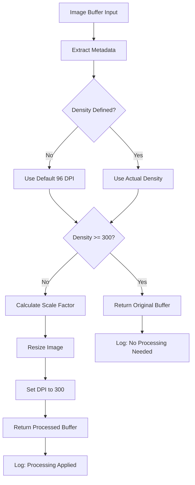

# Design Document

## Overview

The DPI optimization feature enhances the existing image validation system by implementing intelligent DPI processing that only resizes images when necessary and handles TypeScript type safety issues. The design focuses on performance optimization and code reliability.

## Architecture

The optimization will be implemented within the existing `resizeAndChangeDPI` function in `src/utils/index.ts`. The function will use a conditional processing approach based on metadata analysis.

### Processing Flow



## Components and Interfaces

### Enhanced resizeAndChangeDPI Function

```typescript
async function resizeAndChangeDPI(fileBuffer: Buffer): Promise<Buffer | undefined>;
```

**Input:**

- `fileBuffer: Buffer` - The original image buffer

**Output:**

- `Buffer | undefined` - Processed buffer or original buffer if no processing needed

**Key Logic:**

1. Extract metadata with proper null checking
2. Determine effective DPI (actual or default)
3. Conditional processing based on DPI comparison
4. Enhanced logging for transparency

## Data Models

### Metadata Handling

The function will handle Sharp metadata with the following considerations:

```typescript
interface ProcessedMetadata {
  width: number;
  height: number;
  effectiveDPI: number; // Computed from density || default
  needsProcessing: boolean;
}
```

## Error Handling

### Type Safety

- Handle `metadata.density` being undefined using nullish coalescing
- Provide sensible defaults for missing metadata
- Ensure all numeric operations have proper type guards

### Processing Errors

- Wrap Sharp operations in try-catch blocks
- Return undefined on processing failures
- Log detailed error information for debugging

## Testing Strategy

### Unit Tests

1. Test with images already at 300 DPI
2. Test with images at various DPI levels (72, 96, 150, 600)
3. Test with images lacking DPI metadata
4. Test error handling for corrupted images

### Integration Tests

1. Verify the function works within the validation workflow
2. Test performance improvements with high-DPI images
3. Validate logging output accuracy

### Type Safety Tests

1. Ensure TypeScript compilation without errors
2. Test runtime behavior with undefined metadata values
